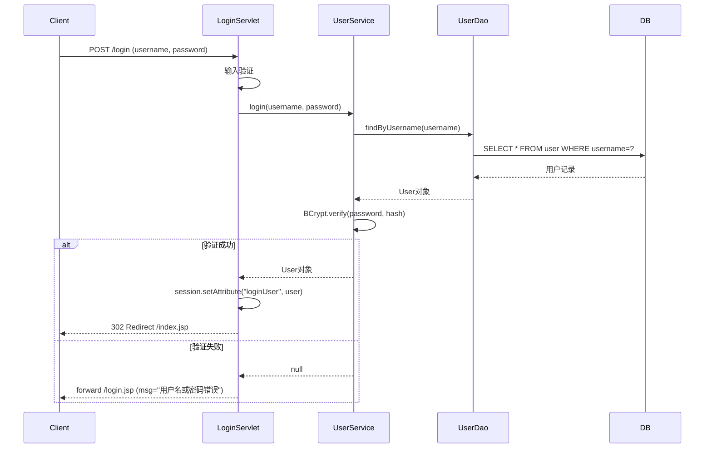
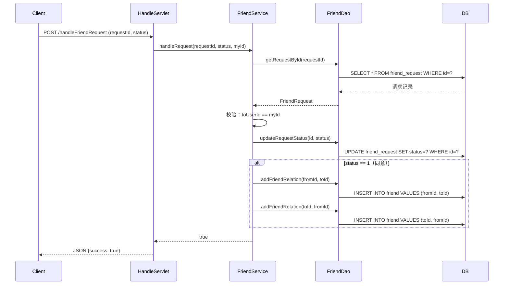
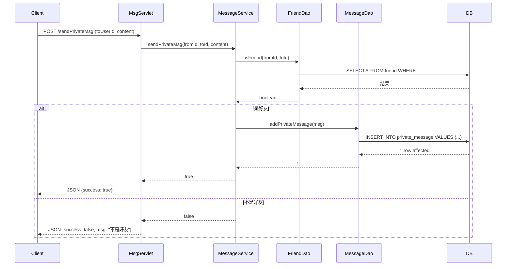

# ChatWithYou 即时聊天系统 - 项目文档

## 一、项目概述

### 1.1 项目简介

**ChatWithYou** 是一个基于 Java Servlet + JSP + MySQL 技术栈开发的即时聊天系统，采用经典的 MVC 分层架构，实现了用户管理、好友系统和私聊功能。

### 1.2 技术栈

| 层级 | 技术 | 版本 |
|------|------|------|
| 语言 | Java | 17 |
| Web 框架 | Java Servlet | 4.0 |
| 视图层 | JSP | 2.3 |
| 数据库 | MySQL | 8.0 |
| 构建工具 | Maven | 3.6+ |
| 前端框架 | Bootstrap | 5.3 |
| 密码加密 | BCrypt | 0.4 |
| 实时通信 | AJAX轮询 | 2秒间隔 |
| JSON处理 | Gson | 2.10.1 |

### 1.3 功能模块

- **用户管理**：注册、登录、注销、个人资料修改
- **好友系统**：搜索用户、发送好友请求、处理请求、好友列表
- **私聊功能**：发送消息、接收消息、AJAX轮询、未读消息提示

---

## 二、项目结构

```
ChatWithYou/
├── src/main/java/liyu/
│   ├── control/          # 控制层（Servlet）
│   ├── dao/              # 数据访问层（接口）
│   │   └── impl/         # DAO实现类
│   ├── model/            # 模型层（实体类）
│   ├── services/         # 业务层（接口）
│   │   └── impl/         # Service实现类
│   └── util/             # 工具类
├── src/main/resources/
│   └── db.properties     # 数据库配置
├── web/                  # Web资源
│   ├── WEB-INF/
│   │   └── web.xml       # Web配置
│   ├── *.jsp             # 页面文件
│   └── bootstrap-5.3.0-alpha1-dist/
├── target/               # 编译输出
└── pom.xml               # Maven配置
```

---

## 三、各层详细说明

### 3.1 Model 层（实体类）

#### User.java
```java
// 文件路径：src/main/java/liyu/model/User.java
// 对应数据库 user 表
// 属性：id, username, nickname, email, password
// 功能：封装用户信息
```

#### FriendRequest.java
```java
// 文件路径：src/main/java/liyu/model/FriendRequest.java
// 对应数据库 friend_request 表
// 属性：id, fromUserId, toUserId, status(0-待处理 1-同意 2-拒绝), createTime, remark, fromNickname
// 功能：封装好友申请信息
```

#### PrivateMessage.java
```java
// 文件路径：src/main/java/liyu/model/PrivateMessage.java
// 对应数据库 private_message 表
// 属性：id, fromUserId, toUserId, content, isRead, createTime, fromNickname
// 功能：封装私聊消息信息
```

### 3.2 DAO 层（数据访问层）

#### UserDao.java（接口）
| 方法 | 功能 | 参数 | 返回值 |
|------|------|------|--------|
| `findUserById(Integer userId)` | 根据ID查询用户 | 用户ID | User对象 |
| `addUser(User user)` | 添加用户（注册） | User对象 | 受影响行数 |
| `findByUsername(String username)` | 根据用户名查询 | 用户名 | User对象 |
| `updateUser(User user)` | 更新用户信息 | User对象 | 受影响行数 |

#### FriendDao.java（接口）
| 方法 | 功能 | 参数 | 返回值 |
|------|------|------|--------|
| `searchUser(String keyword, Integer myId)` | 搜索用户（排除自己和好友） | 关键词、自己ID | List\<User\> |
| `addFriendRequest(FriendRequest request)` | 添加好友申请 | 申请对象 | 受影响行数 |
| `listMyReceiveRequest(Integer toUserId)` | 查询收到的申请 | 接收者ID | List\<FriendRequest\> |
| `updateRequestStatus(Integer id, Integer status)` | 更新申请状态 | 申请ID、状态 | 受影响行数 |
| `addFriendRelation(Integer userId, Integer friendId)` | 添加好友关系 | 用户ID、好友ID | 受影响行数 |
| `listMyFriends(Integer userId)` | 查询好友列表 | 用户ID | List\<User\> |
| `isFriend(Integer userId, Integer friendId)` | 判断是否好友 | 用户ID、好友ID | boolean |

#### MessageDao.java（接口）
| 方法 | 功能 | 参数 | 返回值 |
|------|------|------|--------|
| `addPrivateMessage(PrivateMessage msg)` | 发送消息 | 消息对象 | 受影响行数 |
| `listPrivateMsg(Integer userId, Integer friendId)` | 查询历史消息 | 用户ID、好友ID | List\<PrivateMessage\> |
| `markRead(Integer myId, Integer friendId)` | 标记消息已读 | 自己ID、好友ID | 受影响行数 |
| `countUnreadMsg(Integer myId, Integer friendId)` | 统计单个好友未读消息 | 自己ID、好友ID | 未读数量 |
| `countAllUnreadMsg(Integer myId)` | 统计所有好友未读消息 | 自己ID | Map(friendId→count) |

### 3.3 Service 层（业务逻辑层）

#### UserServiceImpl.java
```java
// 文件路径：src/main/java/liyu/services/impl/UserServiceImpl.java
// 核心业务：
// 1. register(User user) - 注册：先查重，再加密密码，最后插入
// 2. login(String username, String password) - 登录：查询用户，验证BCrypt密码
// 3. findByUsername(String username) - 根据用户名查询
```

#### FriendServiceImpl.java
```java
// 文件路径：src/main/java/liyu/services/impl/FriendServiceImpl.java
// 核心业务：
// 1. searchUser() - 搜索用户
// 2. sendFriendRequest() - 发送好友请求（校验：不能加自己、不能重复加好友）
// 3. getMyReceiveRequest() - 获取收到的申请列表
// 4. handleRequest() - 处理请求（同意则添加双向好友关系）
// 5. getMyFriends() - 获取好友列表
```

#### MessageServiceImpl.java
```java
// 文件路径：src/main/java/liyu/services/impl/MessageServiceImpl.java
// 核心业务：
// 1. sendPrivateMsg() - 发送消息（校验：必须是好友、内容非空）
// 2. getPrivateMsg() - 获取消息（先标记已读，再查询）
// 3. countUnreadMsg() - 统计单个好友未读消息数量
// 4. countAllUnreadMsg() - 统计所有好友未读消息数量
```

### 3.4 Control 层（Servlet）

| Servlet | 路径 | 功能 |
|---------|------|------|
| LoginServlet | `/login` | 用户登录 |
| RegisterServlet | `/register` | 用户注册 |
| LogoutServlet | `/logout` | 用户注销 |
| ProfileServlet | `/profile` | 个人资料 |
| SearchFriendServlet | `/searchFriend` | 搜索用户 |
| SendFriendRequestServlet | `/sendFriendRequest` | 发送好友请求 |
| FriendRequestListServlet | `/friendRequestList` | 获取申请列表 |
| HandleFriendRequestServlet | `/handleFriendRequest` | 处理申请 |
| FriendListServlet | `/friendList` | 获取好友列表（包含未读消息数量） |
| SendPrivateMsgServlet | `/sendPrivateMsg` | 发送私聊（HTTP方式） |
| GetPrivateMsgServlet | `/getPrivateMsg` | 获取私聊消息（加载历史） |
| GlobalExceptionHandler | `/error` | 全局异常处理 |

### 3.6 Util 层（工具类）

#### JDBCUtils.java
```java
// 文件路径：src/main/java/liyu/util/JDBCUtils.java
// 功能：数据库连接工具
// 方法：getConnection(), close()
```

#### PasswordUtils.java
```java
// 文件路径：src/main/java/liyu/util/PasswordUtils.java
// 功能：BCrypt密码加密与验证
// 方法：hashPassword(), verifyPassword()
```

#### ValidationUtils.java
```java
// 文件路径：src/main/java/liyu/util/ValidationUtils.java
// 功能：输入验证工具
// 方法：validateUsername(), validateNickname(), validateEmail(), validatePassword()
```

---

## 四、数据库设计

### 4.1 user 表（用户表）

| 字段 | 类型 | 约束 | 说明 |
|------|------|------|------|
| id | INT | PRIMARY KEY, AUTO_INCREMENT | 用户ID |
| username | VARCHAR(50) | NOT NULL, UNIQUE | 用户名 |
| nickname | VARCHAR(50) | NOT NULL | 昵称 |
| email | VARCHAR(100) | UNIQUE | 邮箱 |
| password | VARCHAR(255) | NOT NULL | 密码（BCrypt哈希） |
| create_time | DATETIME | DEFAULT CURRENT_TIMESTAMP | 创建时间 |

### 4.2 friend_request 表（好友申请表）

| 字段 | 类型 | 约束 | 说明 |
|------|------|------|------|
| id | INT | PRIMARY KEY, AUTO_INCREMENT | 申请ID |
| from_user_id | INT | NOT NULL, FOREIGN KEY | 申请人ID |
| to_user_id | INT | NOT NULL, FOREIGN KEY | 被申请人ID |
| status | TINYINT | DEFAULT 0 | 状态（0-待处理 1-同意 2-拒绝） |
| remark | VARCHAR(200) | | 备注 |
| create_time | DATETIME | DEFAULT CURRENT_TIMESTAMP | 创建时间 |

### 4.3 friend 表（好友关系表）

| 字段 | 类型 | 约束 | 说明 |
|------|------|------|------|
| id | INT | PRIMARY KEY, AUTO_INCREMENT | 关系ID |
| user_id | INT | NOT NULL, FOREIGN KEY | 用户ID |
| friend_id | INT | NOT NULL, FOREIGN KEY | 好友ID |
| create_time | DATETIME | DEFAULT CURRENT_TIMESTAMP | 创建时间 |

### 4.4 private_message 表（私聊消息表）

| 字段 | 类型 | 约束 | 说明 |
|------|------|------|------|
| id | INT | PRIMARY KEY, AUTO_INCREMENT | 消息ID |
| from_user_id | INT | NOT NULL, FOREIGN KEY | 发送者ID |
| to_user_id | INT | NOT NULL, FOREIGN KEY | 接收者ID |
| content | TEXT | NOT NULL | 消息内容 |
| is_read | TINYINT | DEFAULT 0 | 是否已读（0-未读 1-已读） |
| create_time | DATETIME | DEFAULT CURRENT_TIMESTAMP | 创建时间 |

---

## 五、核心流程图

### 5.1 用户登录流程



### 5.2 好友申请处理流程



### 5.3 消息发送流程



---

## 六、安全特性

### 6.1 密码安全
- 使用 BCrypt 算法对密码进行哈希存储
- 每次哈希使用随机盐值
- 登录时使用 `BCrypt.checkpw()` 验证

### 6.2 输入验证
- 用户名：3-20位字母、数字、下划线
- 昵称：2-20位中文、字母、数字、下划线
- 邮箱：标准邮箱格式验证
- 密码：6-32位，支持特殊字符

### 6.3 异常处理
- GlobalExceptionHandler 统一处理所有异常
- 区分 SQLException、IllegalArgumentException、NullPointerException
- HTTP 错误码 404、403、500 统一处理

---

## 七、前端功能

### 7.1 页面列表

| 页面 | 路径 | 功能 |
|------|------|------|
| login.jsp | /login.jsp | 登录页面 |
| register.jsp | /register.jsp | 注册页面 |
| index.jsp | /index.jsp | 聊天主界面 |
| profile.jsp | /profile.jsp | 个人资料页面 |

### 7.2 交互特性

- 好友列表展示（点击进入聊天）
- 实时消息轮询（3秒刷新）
- 搜索用户添加好友
- 好友申请弹窗管理
- 暗黑主题切换
- 响应式布局（移动端适配）

---

## 八、部署说明

### 8.1 环境要求
- JDK 17+
- Maven 3.6+
- MySQL 8.0+
- Tomcat 9+

### 8.2 部署步骤

1. 创建数据库：`CREATE DATABASE chat_with_you CHARACTER SET utf8mb4;`
2. 导入 SQL 脚本创建表结构
3. 修改 `src/main/resources/db.properties` 配置数据库连接
4. 使用 Maven 打包：`mvn clean package`
5. 将 WAR 包部署到 Tomcat 的 webapps 目录
6. 启动 Tomcat，访问 `http://localhost:8080/ChatWithYou`

---

## 九、项目亮点

1. **分层架构清晰**：MVC 四层架构，职责分明
2. **安全措施完善**：BCrypt 密码加密、输入验证、全局异常处理
3. **功能完整**：用户管理、好友系统、私聊功能齐全
4. **前端体验良好**：响应式布局、暗黑主题、消息实时刷新
5. **代码规范**：命名规范、注释清晰、结构合理
